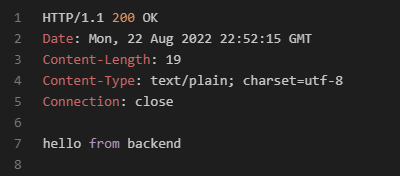
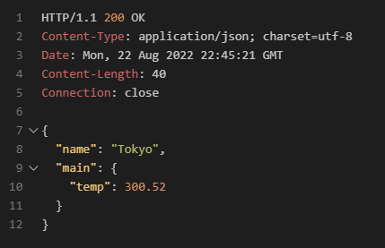

# Weather Tracker Golang
### Prerequisites
Get the Api key from the below mentioned URL and Create a .apiConfig file in the root driectory
Use the Below code for the .apiConfig file
```
{
  "OpenWeatherMapApiKey":"YOUR_API_KEY"
}

```
### Resource for API keys
https://home.openweathermap.org/api_keys
### Run
If you wish to run the project means just clone it and open the project in the cmd.
```
go build
go run main.go
```
Open the browser or any REST client tool and For testing the program use the below url
```
http://localhost:8080/hello
```


Replace the "tokyo" with any city name as you wish to get different temperature

```
http://localhost:8080/weather/tokyo
```



### Acknowledgements
:bulb: [AkhilSharmaTech](https://www.youtube.com/c/AkhilSharmaTech)